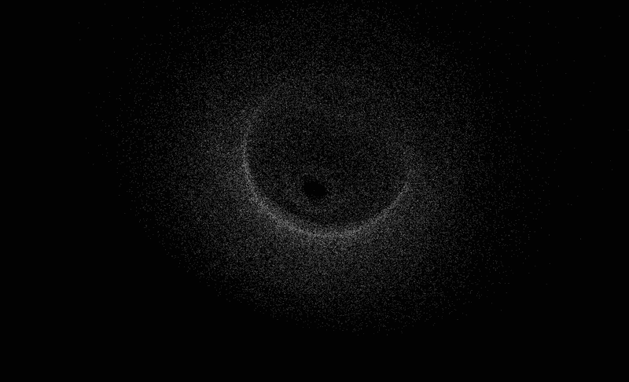
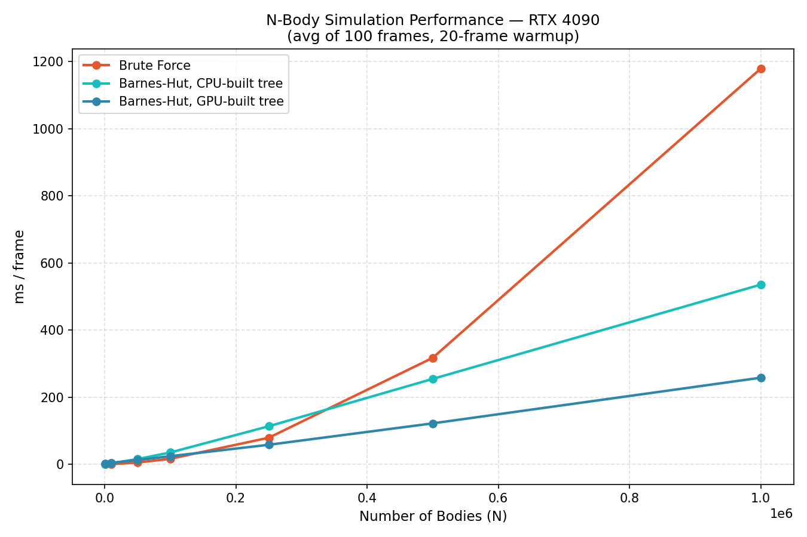

<a id="readme-top"></a>

[![LinkedIn][linkedin-shield]](https://www.linkedin.com/in/aryan-salian/)


<br />
<div align="center">



<h3 align="center">CUDA N-Body Simulation</h3>

  <p align="center">
    A GPU-programmed gravitational N-body simulation, featuring the Barnes-Hut O(N log N) algorithm with GPU and CPU tree building versions (OpenGL), and a brute force O(N²) algorithm (SFML).
    <br />
    <br />
    <a href="https://github.com/asalian23/nbody">View Demo</a>
    &middot;
    <a href="https://github.com/asalian23/nbody/issues/new?labels=bug&template=bug-report---.md">Report Bug</a>
    &middot;
    <a href="https://github.com/asalian23/nbody/issues/new?labels=enhancement&template=feature-request---.md">Request Feature</a>
  </p>
</div>


<details>
  <summary>Table of Contents</summary>
  <ol>
    <li>
      <a href="#about-the-project">About The Project</a>
      <ul>
        <li><a href="#built-with">Built With</a></li>
      </ul>
    </li>
    <li>
      <a href="#getting-started">Getting Started</a>
      <ul>
        <li><a href="#prerequisites">Prerequisites</a></li>
        <li><a href="#installation">Installation</a></li>
      </ul>
    </li>
    <li><a href="#how-it-works">How It Works</a></li>
    <li><a href="#benchmarks">Benchmarks</a></li>
    <li><a href="#roadmap">Roadmap</a></li>
    <li><a href="#license">License</a></li>
    <li><a href="#contact">Contact</a></li>
  </ol>
</details>


## About The Project


A gravitational N-body simulation written in C++ and CUDA. I have three main iterations of the simulation:

- **Brute Force (O(N²))** — Every body computes and aggregates its acceleration towards every other body using shared memory tiling for efficient GPU utilization. Rendered with SFML.
- **Barnes-Hut, CPU-built tree (O(N log N))** — An octree is built on the CPU each frame to approximate sufficiently distant or small body groups as point masses, with the tree traversal and acceleration aggregation running on the GPU. Rendered in 3D via CUDA-OpenGL interop.
- **Barnes-Hut, GPU-built tree (O(N log N))** — The same octree approximation, but the tree is built entirely on the GPU each frame from Morton-coded (Z-order) body positions, removing the CPU as a per-frame bottleneck. Also rendered in 3D via CUDA-OpenGL interop.

All versions use leapfrog integration calculating position and velocity, Plummer softening to prevent force explosions and NaN poisoning, and astronomical units (AU, solar masses, seconds) to keep values within a float's range.

I built this project to understand GPU programming, hardware limitations, and data structures. Key topics included CUDA memory types such as shared, global, registers, constant, float limitations and numerical stability as NaN poisoning issues were resolved, the practical tradeoffs between brute force and Barnes-Hut algorithms, and stack-based tree traversal through flat arrays simulating trees.

<p align="right">(<a href="#readme-top">back to top</a>)</p>


### Built With

* [![CUDA][CUDA-badge]][CUDA-url]
* [![C++][CPP-badge]][CPP-url]
* [![OpenGL][OpenGL-badge]][OpenGL-url]
* [![GLFW][GLFW-badge]][GLFW-url]
* [![glad][glad-badge]][glad-url]

<p align="right">(<a href="#readme-top">back to top</a>)</p>


## Getting Started

### Prerequisites

- An NVIDIA GPU with CUDA support (tested on RTX 4090)
- [CUDA Toolkit 13.3](https://developer.nvidia.com/cuda-toolkit)
- A C++ compiler with C++17 support
- Thrust — bundled with the CUDA Toolkit, used by the GPU-tree build for `thrust::sort_by_key` (no separate install needed)

OpenGL Requires:
- [GLFW 3.4](https://www.glfw.org/) for window/context creation
- [glad](https://glad.dav1d.de/) generated for **OpenGL 4.6, Core Profile** — this must match the context requested in code (`GLFW_CONTEXT_VERSION_MAJOR/MINOR = 4.6`, `GLFW_OPENGL_CORE_PROFILE`, and the `#version 460 core` GLSL shaders)

### Installation

> **NOTE (you fill in):** fill in real include/lib paths for GLFW and glad below, and confirm the link flags (`-lopengl32` on Windows vs `-lGL -ldl` on Linux). Also confirm the actual output filenames/source filenames for the CPU-tree vs GPU-tree Barnes-Hut builds — right now both would compile from something like `nbody.cu`, so you likely want to distinguish them (e.g. separate files, or a `#define`/build flag).

1. Clone the repo
   ```sh
   git clone https://github.com/asalian23/nbody.git
   ```

2. Build the project
```sh
   cd nBody
```
   Barnes-Hut — GPU-built tree version:
```sh
   nvcc nbodyGPUTreeVersion.cu C:\glad\src\glad.c -o nbodyGPUTreeVersion.exe -std=c++17 -diag-suppress 1394 -diag-suppress 1388 -I "C:\glad\include" -I "C:\GLFW\glfw-3.4.bin.WIN64\include" -L "C:\GLFW\glfw-3.4.bin.WIN64\lib-vc2022" -Xcompiler "/MD /Zc:preprocessor" -lglfw3 -lopengl32 -lgdi32 -luser32 -lshell32
```
   Barnes-Hut — CPU-built tree version:
```sh
   nvcc nbodyCPUTreeVersion.cu C:\glad\src\glad.c -o nbodyCPUTreeVersion.exe -std=c++17 -arch=sm_120 -diag-suppress 1394 -diag-suppress 1388 -I "C:\glad\include" -I "C:\GLFW\glfw-3.4.bin.WIN64\include" -L "C:\GLFW\glfw-3.4.bin.WIN64\lib-vc2022" -Xcompiler "/MD /Zc:preprocessor" -lglfw3 -lopengl32 -lgdi32 -luser32 -lshell32
```
   Brute force version:
```sh
   nvcc bruteforce.cu glad.c -o bruteforceVersion.exe -std=c++17 -diag-suppress 1394 -diag-suppress 1388 -I "path\to\glfw\include" -I "path\to\glad\include" -L "path\to\glfw\lib" -lglfw3 -lopengl32
```

<p align="right">(<a href="#readme-top">back to top</a>)</p>


## How It Works

### Physics

All bodies interact through Newton's law of gravitation. To avoid force explosions and NaN poisoning from close and overlapping bodies, Plummer softening is applied:

```
F = G * M * diff / (r² + ε²)^(3/2)
```

where `ε` is the softening length (set to the solar radius in AU). Time integration uses the symplectic leapfrog (kick-drift-kick) scheme, which conserves energy better than naive Euler integration.

### Unit System

Rather than SI units, astronomical units are used to keep values within the range of a float (~3.4 × 10³⁸ max):

| Quantity | Unit | Notes |
|----------|------|-------|
| Distance | AU (Astronomical Unit) | 1 AU ≈ 1.496 × 10¹¹ m |
| Mass | Solar masses (M☉) | 1 M☉ ≈ 1.989 × 10³⁰ kg |
| Time | Seconds | Unchanged from SI |
| G | 3.964 × 10⁻¹⁴ AU³/(M☉·s²) | Derived from SI G |

### Barnes-Hut Algorithm — CPU-Built Tree

1. **Tree Build (CPU)** — A root node is sized to bound the whole body set (min/max scan across all positions, padded slightly to avoid edge cases). Bodies are inserted one at a time: if a node is empty, the body is placed directly and the node becomes a leaf. If the node is already a leaf holding a body, it's converted into an internal node — the existing body is re-inserted into the correct child octant, then the new body follows the same path. A depth cap prevents infinite recursion when bodies are nearly coincident.
2. **Center of Mass Pass (CPU)** — A bottom-up recursive traversal. Leaf and empty nodes already have a correct mass/COM from insertion. For internal nodes, the traversal recurses into each of the 8 children first, then aggregates total mass and mass-weighted center of mass from whichever children exist.
3. **Force Calculation (GPU)** — Identical to the GPU-tree version: each thread walks the tree iteratively with a fixed-size stack, applying the same `size / distance ≤ θ` criterion. Only the used portion of the CPU-built node array is copied to the GPU each frame.

### Barnes-Hut Algorithm — GPU-Built Tree

1. **Morton Encoding (GPU)** — Each body's 3D position is normalized against a fixed bounding range and quantized to 10 bits per axis, then the bits are interleaved into a single 30-bit Morton (Z-order) code, giving every body a sortable key that reflects spatial locality.
2. **Spatial Sort (GPU)** — `thrust::sort_by_key` sorts a body-index array by Morton code, so spatially nearby bodies land contiguously in memory.
3. **Level-by-Level Tree Build (GPU)** — Starting from a single root task covering the full sorted range, the `splitLevel` kernel processes a queue of build tasks in parallel. Each task partitions its `[start, end)` range into up to 8 child octants by comparing 3-bit groups of the Morton code at the current depth, atomically pushes new child tasks onto a queue for the next level, and terminates a branch once a range holds one body, all bodies in range share a code, or a depth cap (10) is hit. Levels are processed one at a time until the task queue empties.
4. **Center of Mass Pass (GPU, bottom-up)** — The `calcCOMByLvl` kernel processes the tree one level at a time, from the deepest level back up to the root, aggregating each node's mass and center of mass from its children (or directly from its bodies, for leaves holding multiple co-located bodies).
5. **Force Calculation (GPU)** — Same traversal as the CPU-tree version: each thread walks the tree with a fixed-size stack, applying the `size / distance ≤ θ` criterion to decide whether to approximate a node as a point mass or descend into its children.

### Rendering — CUDA-OpenGL Interop (Barnes-Hut, both variants)

Both Barnes-Hut variants render through the same CUDA-OpenGL interop path. An OpenGL VBO is registered with CUDA via `cudaGraphicsGLRegisterBuffer` and mapped each frame with `cudaGraphicsMapResources`, giving a CUDA kernel (`writeToVBO`) a direct device pointer into the buffer. That kernel takes each body's simulation-space position, applies a 3D camera rotation (adjustable X/Y tilt) and a perspective projection, and writes the resulting screen-space coordinates plus a color straight into the VBO — no CPU round-trip. Once unmapped, a minimal GLSL shader pair (`#version 460 core`) draws every body as a point in a single `glDrawArrays` call, with the central mass rendered in a distinct color from the rest. Brute force does **not** use this path — it still renders through SFML.

### GPU Optimizations

- **Stack Tree Traversal** (both Barnes-Hut variants) — GPU threads are inefficient with recursion, so the force kernel traverses the tree iteratively using a fixed-size stack array to track which nodes still need visiting.
- **float32 implementation** (all variants) — Switched all doubles to floats. On the RTX 4090, float throughput is 64× higher than double throughput. Required conversion from SI to astronomical units to keep values within float range.
- **`rsqrtf` intrinsic** (all variants) — Replaces separate `sqrt` and divide with a single-cycle instruction when computing softened forces.
- **Shared memory tiling** (brute force only) — Bodies are loaded into shared memory in tiles of 256, so a block's worth of threads reuses one shared-memory load per tile instead of each thread hitting global memory independently. 256 was chosen as 8 full warps (avoids wasted lanes), while keeping the shared-memory footprint per block (~40 bytes/body × 256 = 10 KB) small enough that multiple blocks stay resident per SM.
- **Morton-code spatial sort + GPU tree construction** (GPU-tree variant only) — Replaces per-frame CPU tree building with a fully parallel, level-by-level GPU build, removing the CPU as a bottleneck and keeping the whole physics step device-resident.
- **Minimal data transfer** (CPU-tree variant) — Only the number of nodes actually used by that frame's tree (not the full preallocated buffer) is copied from host to device each frame.
- **CUDA-OpenGL Interop** (both Barnes-Hut variants) — Body positions are projected and written straight into the render VBO by a CUDA kernel, eliminating the CPU memcpy that would otherwise sit between the physics step and rendering.


<p align="right">(<a href="#readme-top">back to top</a>)</p>


## Benchmarks

Tested on an RTX 4090. Each measurement is the average of 10 frames after a 10-frame warmup.

markdown
| N (bodies) | Barnes-Hut (ms/frame) | Brute Force (ms/frame) | Speedup |
|------------|----------------------|----------------------|---------|
| 1,000 | 0.73 | 0.18 | 0.25× |
| 10,000 | 3.17 | 0.91 | 0.29× |
| 25,000 | 7.01 | 2.06 | 0.29× |
| 50,000 | 14.05 | 4.41 | 0.31× |
| 75,000 | 22.89 | 9.14 | 0.40× |
| 100,000 | 31.62 | 15.45 | 0.49× |
| 200,000 | 75.23 | 54.61 | 0.73× |
| 300,000 | 120.03 | 115.87 | 0.97× |
| 350,000 | 150.49 | 151.81 | 1.01× |
| 400,000 | 177.24 | 201.96 | 1.14× |
| 500,000 | 226.91 | 303.34 | 1.34× |
| 600,000 | 287.03 | 438.60 | 1.53× |
| 700,000 | 359.29 | 585.75 | 1.63× |
| 800,000 | 425.24 | 743.26 | 1.75× |
| 900,000 | 496.75 | 963.94 | 1.94× |
| 1,000,000 | 563.02 | 1,184.79 | 2.10× |

Barnes-Hut outpaces brute force at about 350K bodies. The experimental crossover point is higher than the theoretical due to the overhead added from CPU-side tree building and memory transfers.




<p align="right">(<a href="#readme-top">back to top</a>)</p>


## Roadmap

- [x] CPU N-body physics engine (Vec3, leapfrog, pairwise forces)
- [x] CUDA brute force O(N²) kernel with shared memory tiling
- [x] Real-time SFML visualization (sf::VertexArray single draw call)
- [x] GPU benchmarks — O(N²) scaling verified, occupancy cliff identified
- [x] Barnes-Hut sparse quadtree — CPU tree build, GPU force traversal
- [x] Float32 support with astronomical unit system
- [x] Barnes-Hut benchmarks and crossover analysis
- [ ] 3D simulation with OpenGL rendering
- [ ] CUDA-OpenGL interoperability (eliminate CPU memcpy bottleneck)
- [ ] Yoshida 4th-order symplectic integrator
- [ ] Full GPU tree construction (Burtscher & Pingali approach)
- [ ] Galaxy collision scenario


<p align="right">(<a href="#readme-top">back to top</a>)</p>


## License

Distributed under the MIT License. See `LICENSE.txt` for more information.

<p align="right">(<a href="#readme-top">back to top</a>)</p>


## Contact

Aryan Salian - aryansalian21@gmail.com

Project Link: [https://github.com/asalian23/nbody](https://github.com/asalian23/nbody)

<p align="right">(<a href="#readme-top">back to top</a>)</p>


<!-- links and images -->
[linkedin-shield]: https://img.shields.io/badge/-LinkedIn-black.svg?style=for-the-badge&logo=linkedin&colorB=555
[CUDA-badge]: https://img.shields.io/badge/CUDA-76B900?style=for-the-badge&logo=nvidia&logoColor=white
[CUDA-url]: https://developer.nvidia.com/cuda-toolkit
[CPP-badge]: https://img.shields.io/badge/C++-00599C?style=for-the-badge&logo=cplusplus&logoColor=white
[CPP-url]: https://isocpp.org/
[OpenGL-badge]: https://img.shields.io/badge/OpenGL-5586A4?style=for-the-badge&logo=opengl&logoColor=white
[OpenGL-url]: https://www.opengl.org/
[GLFW-badge]: https://img.shields.io/badge/GLFW-black?style=for-the-badge
[GLFW-url]: https://www.glfw.org/
[glad-badge]: https://img.shields.io/badge/glad-white?style=for-the-badge
[glad-url]: https://glad.dav1d.de/
[SFML-badge]: https://img.shields.io/badge/SFML-8CC445?style=for-the-badge&logo=sfml&logoColor=white
[SFML-url]: https://www.sfml-dev.org/
