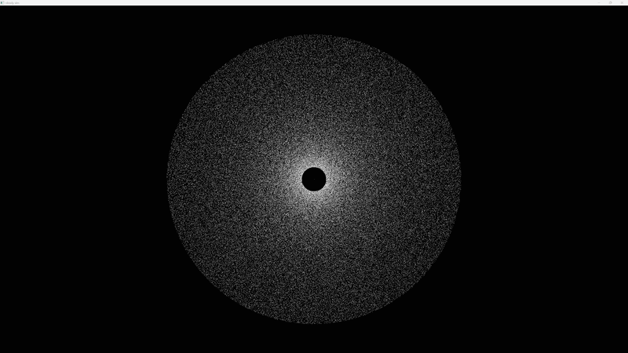
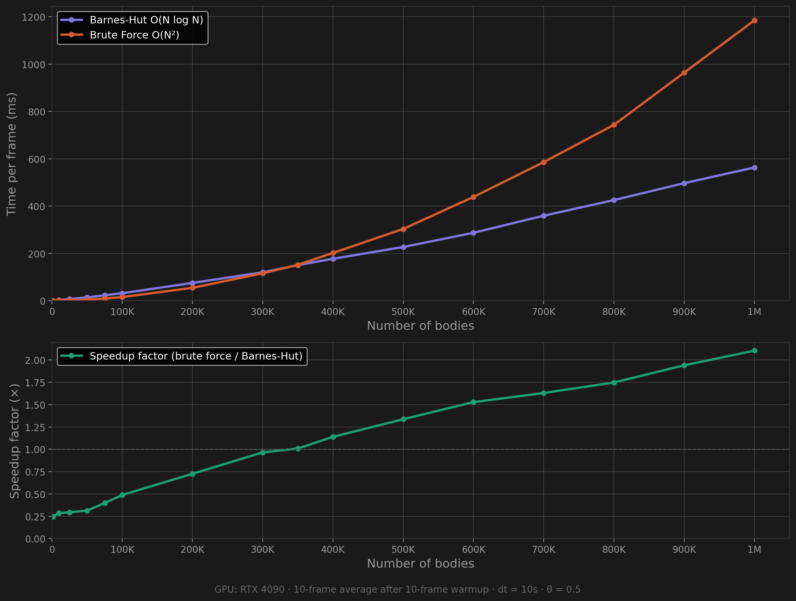

<a id="readme-top"></a>

[![LinkedIn][linkedin-shield]](https://www.linkedin.com/in/aryan-salian/)


<br />
<div align="center">



<h3 align="center">CUDA N-Body Simulation</h3>

  <p align="center">
    A GPU-programmed gravitational N-body simulation displaying 1M bodies in real time, featuring both brute force O(N²) and Barnes-Hut O(N log N) algorithms.
    <br />
    <br />
    <a href="https://github.com/asalian23/nbody">View Demo</a>
    &middot;
    <a href="https://github.com/asalian23/nbody/issues/new?labels=bug&template=bug-report---.md">Report Bug</a>
    &middot;
    <a href="https://github.com/asalian23/nbody/issues/new?labels=enhancement&template=feature-request---.md">Request Feature</a>
  </p>
</div>


<details>
  <summary>Table of Contents</summary>
  <ol>
    <li>
      <a href="#about-the-project">About The Project</a>
      <ul>
        <li><a href="#built-with">Built With</a></li>
      </ul>
    </li>
    <li>
      <a href="#getting-started">Getting Started</a>
      <ul>
        <li><a href="#prerequisites">Prerequisites</a></li>
        <li><a href="#installation">Installation</a></li>
      </ul>
    </li>
    <li><a href="#how-it-works">How It Works</a></li>
    <li><a href="#benchmarks">Benchmarks</a></li>
    <li><a href="#roadmap">Roadmap</a></li>
    <li><a href="#license">License</a></li>
    <li><a href="#contact">Contact</a></li>
  </ol>
</details>


## About The Project


A gravitational N-body simulation written in C++ and CUDA, rendered with SFML. I've approached the problem with two different solutions:

- **Brute Force (O(N²))** — Every body computes and aggregates its acceleration towards every other body using shared memory tiling for efficient GPU utilization.
- **Barnes-Hut (O(N log N))** — A quadtree is built on the CPU each frame to approximate sufficiently distant or small body groups as point masses, with the tree traversal and acceleration aggregation running on the GPU.

Both versions use leapfrog integration calculating position and velocity, Plummer softening to prevent force explosions and NaN poisoning, and astronomical units (AU, solar masses, seconds) to keep values within a float's range.

I built this project to understand GPU programming, hardware limitations, and their quirks. Key topics included CUDA memory types such as shared, global, registers, constant, float limitations and numerical stability as NaN poisoning issues were resolved, the practical tradeoffs between brute force and Barnes-Hut algorithms, and stack-based tree traversal through flat arrays simulating trees.

<p align="right">(<a href="#readme-top">back to top</a>)</p>


### Built With

* [![CUDA][CUDA-badge]][CUDA-url]
* [![C++][CPP-badge]][CPP-url]
* [![SFML][SFML-badge]][SFML-url]

<p align="right">(<a href="#readme-top">back to top</a>)</p>


## Getting Started

### Prerequisites

- An NVIDIA GPU with CUDA support (tested on RTX 4090)
- [CUDA Toolkit 13.2](https://developer.nvidia.com/cuda-toolkit)
- [SFML 3.0.2](https://www.sfml-dev.org/)
- A C++ compiler with C++17 support

### Installation

1. Clone the repo
   ```sh
   git clone https://github.com/asalian23/nbody.git
   ```

2. Build the project
```sh
   cd nBody
```
   Barnes-Hut version:
```sh
   nvcc nbody.cu -o dnbody.exe -std=c++17 -diag-suppress 1394 -diag-suppress 1388 -I "C:\SFML\SFML-3.0.2\include" -L "C:\SFML\SFML-3.0.2\lib" -lsfml-graphics -lsfml-window -lsfml-system
```
   Brute force version:
```sh
   nvcc bruteforce.cu -o bf.exe -std=c++17 -diag-suppress 1394 -diag-suppress 1388 -I "C:\SFML\SFML-3.0.2\include" -L "C:\SFML\SFML-3.0.2\lib" -lsfml-graphics -lsfml-window -lsfml-system
```

<p align="right">(<a href="#readme-top">back to top</a>)</p>


## How It Works

### Physics

All bodies interact through Newton's law of gravitation. To avoid force explosions and NaN poisoning from close and overlapping bodies, Plummer softening is applied:

```
F = G * M * diff / (r² + ε²)^(3/2)
```

where `ε` is the softening length (set to the solar radius in AU). Time integration uses the symplectic leapfrog (kick-drift-kick) scheme, which conserves energy better than naive Euler integration.

### Unit System

Rather than SI units, astronomical units are used to keep values within the range of a float (~3.4 × 10³⁸ max):

| Quantity | Unit | Notes |
|----------|------|-------|
| Distance | AU (Astronomical Unit) | 1 AU ≈ 1.496 × 10¹¹ m |
| Mass | Solar masses (M☉) | 1 M☉ ≈ 1.989 × 10³⁰ kg |
| Time | Seconds | Unchanged from SI |
| G | 3.964 × 10⁻¹⁴ AU³/(M☉·s²) | Derived from SI G |

### Barnes-Hut Algorithm

1. **Tree Build (CPU)** — A new sparse quadtree is created each frame, dividing until each body is contained in leaves.
2. **Center of Mass Pass (CPU)** — A bottom-up traversal computes the total mass and center of mass for each internal node by aggregating its children.
3. **Force Calculation (GPU)** — Each thread walks the tree with a stack. If a node's `size / distance ≤ θ` (default 0.5), the node is treated as a single body. If it does not satisfy the theta criterion, we recurse into its children.

### GPU Optimizations

- **Stack Tree Traversal** — GPU threads are inefficient with recursion so instead the kernel traverses the tree iteratively utilizing a stack array to identify what nodes need to be visited.
- **float32 implementation** — Switched all doubles to floats. On the RTX 4090, float throughput is 64× higher than double throughput. Required conversion from SI to astronomical units.
- **`rsqrtf` intrinsic** — Replaces separate `sqrt` and divides with a single-cycle instruction, computing softened forces.
- **Shared memory tiling** (only in brute force) — Bodies are loaded into shared memory in tiles of 256, reducing global memory bandwidth.
- **Minimal data transfer** — Only the required number of tree nodes are copied to the GPU each frame.


<p align="right">(<a href="#readme-top">back to top</a>)</p>


## Benchmarks

Tested on an RTX 4090. Each measurement is the average of 10 frames after a 10-frame warmup.

markdown
| N (bodies) | Barnes-Hut (ms/frame) | Brute Force (ms/frame) | Speedup |
|------------|----------------------|----------------------|---------|
| 1,000 | 0.73 | 0.18 | 0.25× |
| 10,000 | 3.17 | 0.91 | 0.29× |
| 25,000 | 7.01 | 2.06 | 0.29× |
| 50,000 | 14.05 | 4.41 | 0.31× |
| 75,000 | 22.89 | 9.14 | 0.40× |
| 100,000 | 31.62 | 15.45 | 0.49× |
| 200,000 | 75.23 | 54.61 | 0.73× |
| 300,000 | 120.03 | 115.87 | 0.97× |
| 350,000 | 150.49 | 151.81 | 1.01× |
| 400,000 | 177.24 | 201.96 | 1.14× |
| 500,000 | 226.91 | 303.34 | 1.34× |
| 600,000 | 287.03 | 438.60 | 1.53× |
| 700,000 | 359.29 | 585.75 | 1.63× |
| 800,000 | 425.24 | 743.26 | 1.75× |
| 900,000 | 496.75 | 963.94 | 1.94× |
| 1,000,000 | 563.02 | 1,184.79 | 2.10× |

Barnes-Hut outpaces brute force at about 350K bodies. The experimental crossover point is higher than the theoretical due to the overhead added from CPU-side tree building and memory transfers.




<p align="right">(<a href="#readme-top">back to top</a>)</p>


## Roadmap

- [x] CPU N-body physics engine (Vec3, leapfrog, pairwise forces)
- [x] CUDA brute force O(N²) kernel with shared memory tiling
- [x] Real-time SFML visualization (sf::VertexArray single draw call)
- [x] GPU benchmarks — O(N²) scaling verified, occupancy cliff identified
- [x] Barnes-Hut sparse quadtree — CPU tree build, GPU force traversal
- [x] Float32 support with astronomical unit system
- [x] Barnes-Hut benchmarks and crossover analysis
- [ ] 3D simulation with OpenGL rendering
- [ ] CUDA-OpenGL interoperability (eliminate CPU memcpy bottleneck)
- [ ] Yoshida 4th-order symplectic integrator
- [ ] Full GPU tree construction (Burtscher & Pingali approach)
- [ ] Galaxy collision scenario


<p align="right">(<a href="#readme-top">back to top</a>)</p>


## License

Distributed under the MIT License. See `LICENSE.txt` for more information.

<p align="right">(<a href="#readme-top">back to top</a>)</p>


## Contact

Aryan Salian - aryansalian21@gmail.com

Project Link: [https://github.com/asalian23/nbody](https://github.com/asalian23/nbody)

<p align="right">(<a href="#readme-top">back to top</a>)</p>


<!-- links and images -->
[linkedin-shield]: https://img.shields.io/badge/-LinkedIn-black.svg?style=for-the-badge&logo=linkedin&colorB=555
[CUDA-badge]: https://img.shields.io/badge/CUDA-76B900?style=for-the-badge&logo=nvidia&logoColor=white
[CUDA-url]: https://developer.nvidia.com/cuda-toolkit
[CPP-badge]: https://img.shields.io/badge/C++-00599C?style=for-the-badge&logo=cplusplus&logoColor=white
[CPP-url]: https://isocpp.org/
[SFML-badge]: https://img.shields.io/badge/SFML-8CC445?style=for-the-badge&logo=sfml&logoColor=white
[SFML-url]: https://www.sfml-dev.org/
